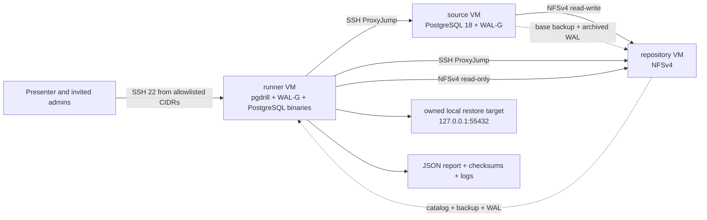

# Yandex Cloud WAL-G Demo

This directory defines a disposable three-VM demo of the WAL-G local restore
path. It is intended for a controlled technical session with synthetic data.
It is not a production deployment template.

Validation status: repository checks only. The Terraform plan and scripts have
not yet been applied to a live Yandex Cloud folder. A successful live rehearsal
and retained report are required before using this environment in a customer
session.

## Topology



- Only the runner has a public IPv4 address.
- Source and repository SSH are reachable only through the runner security
  group.
- The runner mounts the backup repository read-only.
- NFS preserves Unix identities: only the fixed `postgres` UID/GID can write
  from the source, while ordinary SSH users cannot read or mutate repository
  files directly.
- The restored PostgreSQL listens only on runner loopback, and pgdrill forces
  `archive_mode=off` for the disposable target.
- Private VMs use a shared egress NAT gateway for package and release
  downloads; inbound access is not created by that route.
- The baseline uses the `ubuntu-2404-lts` image family instead of a stale image
  ID.

Yandex Cloud references used by the module:

- [Ubuntu 24.04 LTS image family](https://yandex.cloud/en/marketplace/products/yc/ubuntu-24-04-lts)
- [Security groups](https://yandex.cloud/en/docs/vpc/concepts/security-groups)
- [NAT gateway with Terraform](https://yandex.cloud/en/docs/vpc/operations/create-nat-gateway)
- [Linux VM and SSH access](https://yandex.cloud/en/docs/compute/operations/vm-create/create-linux-vm)
- [Cloud-init user data](https://yandex.cloud/en/docs/compute/operations/vm-create/create-with-cloud-init-scripts)

## Access Model

`owner_user` receives sudo on all three VMs and is used only to provision and
repair the demo. Every entry in `admin_ssh_public_key_paths` gets a separate
runner and source login without general sudo; the repository remains
owner-only. On the runner, those administrators may execute only these fixed
commands as `postgres`:

```sh
sudo -u postgres /usr/local/sbin/pgdrill-demo-doctor
sudo -u postgres /usr/local/sbin/pgdrill-demo-run
sudo -u postgres /usr/local/sbin/pgdrill-demo-report
```

On the source they may execute the fixed read-only status command:

```sh
sudo -u postgres /usr/local/sbin/pgdrill-demo-source-status
```

The security group rejects SSH source ranges broader than `/16`, including
`0.0.0.0/0`. Password and root SSH login are disabled. The full administrator
list must be set before the first apply; changing SSH identities intentionally
replaces the affected VMs so cloud-init cannot leave access metadata and actual
accounts out of sync. An owner-key change replaces all three VMs; an invited
administrator change replaces only the source and runner.

The source and runner reserve UID/GID `2000` for `postgres`; the repository
reserves the same numeric identity for its locked storage account. NFS uses
`root_squash`, not `all_squash`, so invited shell accounts do not inherit
repository-owner permissions. The bootstrap fails closed if that identity is
already occupied.

This metadata-key model avoids requiring a Yandex Cloud Organization for the
first isolated demo. A customer pilot should prefer OS Login or the customer's
existing access system when available.

After apply, hand each participant only their own private-key instructions and
the generated destinations; never share the owner key:

```sh
terraform output -json admin_access
```

After the first successful scenario, run the access acceptance test with that
participant's private key:

```sh
demo/yandex-cloud/scripts/audit-admin-access.sh \
  --admin customer-admin \
  --identity ~/.ssh/customer-admin
```

The audit is read-only. It requires an existing current report because it also
proves that the administrator can use the fixed report wrapper.

## Prerequisites

- Terraform `>= 1.5`.
- ShellCheck `>= 0.11` for the repository infrastructure gate.
- Yandex Cloud CLI and an authenticated provisioning identity.
- Permission to create Compute instances, VPC network resources, security
  groups, a public runner address, and a shared egress gateway.
- An owner SSH key and the final public keys for invited administrators.
- A clean pgdrill commit and a Linux amd64 release archive built from it.
- Trusted public IPv4 CIDRs for every participant who needs SSH.

Keep provider credentials in the environment. Do not put a token in
`terraform.tfvars`:

```sh
export YC_TOKEN="$(yc iam create-token)"
```

Before provisioning, run the extended repository gate from the repository
root:

```sh
make demo-infra-check
```

The regular `make check` validates Go and Bash syntax without requiring
Terraform or ShellCheck. `demo-infra-check` additionally checks every demo
script, initializes only the locked provider with the backend disabled, and
validates its Terraform schema. It needs registry network access on a fresh
checkout but neither cloud credentials nor a state backend.

## Provision

Prepare the ignored variables file:

```sh
cd demo/yandex-cloud/terraform
cp terraform.tfvars.example terraform.tfvars
${EDITOR:-vi} terraform.tfvars
terraform init
terraform fmt -check -recursive
terraform validate
terraform plan -out=demo.plan
terraform apply demo.plan
```

Review the plan before apply. It should contain exactly three VMs, one public
runner interface, one private subnet, three role-specific security groups, and
one shared egress gateway.

## Build And Bootstrap

From the repository root, build a versioned Linux amd64 archive from the clean
commit that will be demonstrated:

```sh
export GOTOOLCHAIN=go1.26.5
export GOCACHE="$PWD/.cache/go-build"
make -s release-artifacts \
  VERSION=v0.1.0-demo.1 \
  RELEASE_TARGETS=linux/amd64
```

Then install PostgreSQL 18, pinned WAL-G, and that exact pgdrill archive:

```sh
demo/yandex-cloud/scripts/bootstrap.sh \
  --archive dist/pgdrill_0.1.0-demo.1_linux_amd64.tar.gz \
  --identity ~/.ssh/pgdrill-demo-owner
```

The remote bootstrap verifies the pgdrill archive SHA-256, downloads the
official WAL-G `v3.0.8` Ubuntu 24.04 amd64 binary, verifies its pinned SHA-256,
verifies the official PGDG repository-key fingerprint, installs the current
PostgreSQL 18 patch release from PGDG, confirms the runner NFS mount is
read-only, and finishes with `pgdrill doctor`.

## Rehearse The Complete Drill

The scenario reset is marker-guarded and requires an explicit confirmation:

```sh
PGDRILL_DEMO_CONFIRM=YES \
  demo/yandex-cloud/scripts/scenario.sh \
  --identity ~/.ssh/pgdrill-demo-owner
```

It performs these observable steps:

1. Reset only the disposable WAL-G repository.
2. Create a table with 100 rows and take a real full backup.
3. Commit row 101 with `post-backup-wal-sentinel` after the base backup.
4. Switch and wait for that WAL segment to archive.
5. Pass native `wal-g wal-verify integrity`.
6. Run pgdrill from the read-only runner mount.
7. Require the restored target to contain all 101 rows and the sentinel.
8. Require readiness, SQL, `pg_amcheck`, schema dump, policy, and cleanup
   checks to pass.
9. Download the terminal report, source boundary, runner inventory, and
   Terraform inventory into the ignored `.state/reports/` directory, cross-check
   the selected backup and expected boundary, and print their SHA-256 digests.

Each run uses its own report path, checkpoint directory, artifact directory,
console log, and immutable run ID. `current.json` is only a convenience copy.

## Customer Session Gate

Do not schedule the live session until all gates below pass on the exact VMs
and exact pgdrill commit that will be shown:

- `terraform validate` passes with the committed provider lock file.
- `terraform output demo_inventory` matches the intended folder and zone.
- all three `cloud-init status --wait` calls report success;
- bootstrap records exact pgdrill, WAL-G, and PostgreSQL versions;
- source state shows 100 base-backup rows and 101 expected recovered rows;
- two consecutive scenario runs produce valid `passed` reports;
- every required policy verdict is `passed`;
- the work directory is absent after each run;
- an invited administrator can log in and execute the three fixed runner
  commands, but cannot obtain general sudo;
- that administrator cannot modify reports or directly read or write the NFS
  repository from either the source or runner shell;
- source and repository have no public address;
- the Terraform inventory reports `preemptible: false`;
- a destroy plan has been reviewed before the meeting.

Retain one rehearsal report as the known-good baseline. Create a separate
report during the live session; do not substitute the rehearsal result if the
live run fails.

## Teardown

The environment contains only synthetic data, but it still consumes billable
VM, disk, public-address, gateway, and traffic resources. Use the current
Yandex Cloud calculator rather than a hard-coded cost estimate.

After the session:

```sh
cd demo/yandex-cloud/terraform
terraform plan -destroy -out=destroy.plan
terraform apply destroy.plan
terraform show
```

Confirm that the final state contains no managed resources. Retain reports
outside the destroyed VMs only under the agreed evidence policy.

## Next Compatibility Profiles

Add profiles only after this VM baseline passes live:

1. WAL-G with Yandex Object Storage and executor-local secret resolution.
2. Timestamp PITR with a provable before/after transaction boundary.
3. Barman on separate backup and recovery hosts.
4. A customer-shaped topology selected through discovery, not a generic fleet
   UI.
