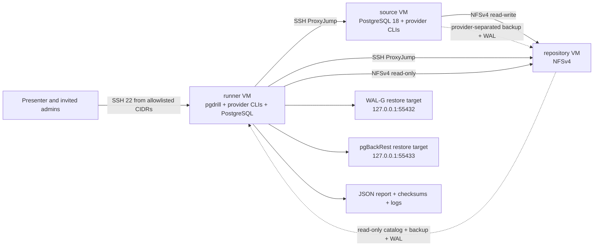

# Yandex Cloud Provider Demo

This directory defines a disposable three-VM demo with independent WAL-G and
pgBackRest local-restore profiles. It is intended for a controlled technical
session with synthetic data. It is not a production deployment template.

Invited participants should start with the
[bounded-access user runbook](USER-RUNBOOK.md). Provisioning, source backup
preparation, evidence export, repair, and teardown remain in this operator
guide.

Validation status: repository checks and both local release-artifact rehearsals
pass. On 2026-07-29 UTC, the exact locally built Linux amd64 `v0.3.0-dev`
WAL-G candidate at commit `444c525c8c104f70ada9b66e8c1b633c6d4e8a0d`,
archive SHA-256
`c1bce1e0e9685365f9fc64f841414dd539f8af112e48f4741b2db73a855542c0`,
completed bootstrap and two consecutive live rehearsals in `ru-central1-a`.
Both reports passed 13 checks and all five required policy assertions.

The exact pgBackRest candidate at commit
`92e8bfcc82165d4ad11a80dbda90790bdc4d0b7d`, archive SHA-256
`f3b1404d3404d689aa16a0f85060af077b6055e372efbfb2c9fecb39fb662552`,
then completed two consecutive rehearsals with pgBackRest 2.58.0 and
PostgreSQL 18.4. Both reports passed 13 checks, all five policy assertions,
operation checkpoint validation, distinct post-backup WAL replay, and owned
cleanup. Source evidence passed two native `check` commands and selected-set
`verify`; runner evidence passed repository-level `verify` and explicitly
skipped `check` because the runner has no PostgreSQL-host access. A final
Terraform refresh reported no changes.

These are owner-operated observations against one NFS topology, not
published-release, customer-pilot, cloud-support, or production-RTO claims.
That recorded rehearsal did not provision an invited administrator; the
bounded-access audit remains a separate per-participant acceptance gate.
The observed infrastructure was destroyed after evidence export. This module
defines a reproducible fresh environment; it is not a continuously available
hosted service.

## Topology


```mermaid
flowchart LR
    A["Presenter and invited admins"] -->|"SSH 22 from allowlisted CIDRs"| R["runner VM<br/>pgdrill + provider CLIs + PostgreSQL"]
    R -->|"SSH ProxyJump"| S["source VM<br/>PostgreSQL 18 + provider CLIs"]
    R -->|"SSH ProxyJump"| B["repository VM<br/>NFSv4"]
    S -->|"NFSv4 read-write"| B
    R -->|"NFSv4 read-only"| B
    S -.->|"provider-separated backup + WAL"| B
    B -.->|"read-only catalog + backup + WAL"| R
    R --> T1["WAL-G restore target<br/>127.0.0.1:55432"]
    R --> T2["pgBackRest restore target<br/>127.0.0.1:55433"]
    R --> E["JSON report + checksums + logs"]
```

- Only the runner has a public IPv4 address, managed as a reserved Terraform
  resource so planned VM stops and starts do not change participant access.
- Source and repository SSH are reachable only through the runner security
  group.
- The runner mounts the backup repository read-only.
- NFS preserves Unix identities: only the fixed `postgres` UID/GID can write
  from the source, while ordinary SSH users cannot read or mutate repository
  files directly.
- The restored PostgreSQL listens only on runner loopback, and pgdrill forces
  `archive_mode=off` for the disposable target.
- Private VMs use a shared egress NAT gateway for package and release
  downloads; inbound access is not created by that route.
- The baseline uses the `ubuntu-2404-lts` image family instead of a stale image
  ID.

Yandex Cloud references used by the module:

- [Ubuntu 24.04 LTS image family](https://yandex.cloud/en/marketplace/products/yc/ubuntu-24-04-lts)
- [Security groups](https://yandex.cloud/en/docs/vpc/concepts/security-groups)
- [NAT gateway with Terraform](https://yandex.cloud/en/docs/vpc/operations/create-nat-gateway)
- [Linux VM and SSH access](https://yandex.cloud/en/docs/compute/operations/vm-create/create-linux-vm)
- [Cloud-init user data](https://yandex.cloud/en/docs/compute/operations/vm-create/create-with-cloud-init-scripts)

## Access Model

`owner_user` receives sudo on all three VMs and is used only to provision and
repair the demo. Every entry in `admin_ssh_public_key_paths` gets a separate
runner and source login without general sudo; the repository remains
owner-only. On the runner, those administrators may execute only these fixed
commands as `postgres`:

```sh
sudo -u postgres /usr/local/sbin/pgdrill-demo-doctor
sudo -u postgres /usr/local/sbin/pgdrill-demo-run
sudo -u postgres /usr/local/sbin/pgdrill-demo-report
sudo -u postgres /usr/local/sbin/pgdrill-demo-pgbackrest-doctor
sudo -u postgres /usr/local/sbin/pgdrill-demo-pgbackrest-run
sudo -u postgres /usr/local/sbin/pgdrill-demo-pgbackrest-report
```

On the source they may execute the fixed read-only status command:

```sh
sudo -u postgres /usr/local/sbin/pgdrill-demo-source-status
sudo -u postgres /usr/local/sbin/pgdrill-demo-pgbackrest-source-status
```

The security group rejects SSH source ranges broader than `/16`, including
`0.0.0.0/0`. Password and root SSH login are disabled. The full administrator
list must be set before the first apply; changing SSH identities intentionally
replaces the affected VMs so cloud-init cannot leave access metadata and actual
accounts out of sync. An owner-key change replaces all three VMs; an invited
administrator change replaces only the source and runner.

The source and runner reserve UID/GID `2000` for `postgres`; the repository
reserves the same numeric identity for its locked storage account. NFS uses
`root_squash`, not `all_squash`, so invited shell accounts do not inherit
repository-owner permissions. The bootstrap fails closed if that identity is
already occupied.

This metadata-key model avoids requiring a Yandex Cloud Organization for the
first isolated demo. A customer pilot should prefer OS Login or the customer's
existing access system when available.

After apply, hand each participant only their own private-key instructions, the
generated destinations, and the [user runbook](USER-RUNBOOK.md); never share
the owner key:

```sh
terraform output -json admin_access
```

After the first successful scenario, run the access acceptance test with that
participant's private key:

```sh
demo/yandex-cloud/scripts/audit-admin-access.sh \
  --admin customer-admin \
  --identity ~/.ssh/customer-admin
```

The audit is read-only. It requires an existing current report because it also
proves that the administrator can use the fixed report wrapper.

## Prerequisites

- Terraform `>= 1.5`.
- ShellCheck `>= 0.11` for the repository infrastructure gate.
- GitHub CLI, or another authenticated way to download exact release assets.
- Yandex Cloud CLI and an authenticated provisioning identity.
- Permission to create Compute instances, VPC network resources, security
  groups, a reserved public runner address, and a shared egress gateway.
- An owner SSH key and the final public keys for invited administrators.
- An immutable published pgdrill Linux amd64 release archive and its checksum.
- Trusted public IPv4 CIDRs for every participant who needs SSH.

Keep provider credentials in the environment. Do not put a token in
`terraform.tfvars`:

```sh
export YC_TOKEN="$(yc iam create-token)"
```

Before provisioning, run the extended repository gate from the repository
root:

```sh
make demo-infra-check
```

The regular `make check` validates Go and Bash syntax without requiring
Terraform or ShellCheck. `demo-infra-check` additionally checks every demo
script, initializes only the locked provider with the backend disabled, and
validates its Terraform schema. It needs registry network access on a fresh
checkout but neither cloud credentials nor a state backend.

Before provisioning the hosted topology, pass the
[local release-artifact rehearsal](../local/README.md) on the architecture
used by the local Docker daemon. It proves the selected release archive can
complete the recovery claim, but it does not replace any cloud gate below.

## Provision

Prepare the ignored variables file:

```sh
cd demo/yandex-cloud/terraform
cp terraform.tfvars.example terraform.tfvars
${EDITOR:-vi} terraform.tfvars
terraform init
terraform fmt -check -recursive
terraform validate
terraform plan -out=demo.plan
terraform apply demo.plan
```

Review the plan before apply. It should contain exactly three VMs, one public
runner interface, one private subnet, three role-specific security groups, and
one shared egress gateway.

## Acquire And Bootstrap

Use the exact published Linux amd64 archive that will be demonstrated. From the
repository root:

```sh
VERSION=v0.2.0-rc.2
RELEASE_DIR="$PWD/demo/yandex-cloud/.state/release/$VERSION"
mkdir -p "$RELEASE_DIR"
gh release download "$VERSION" \
  --repo r314tive/pgdrill \
  --dir "$RELEASE_DIR" \
  --pattern "pgdrill_${VERSION#v}_linux_amd64.tar.gz" \
  --pattern "pgdrill_${VERSION#v}_checksums.txt"
grep 'linux_amd64.tar.gz$' \
  "$RELEASE_DIR/pgdrill_${VERSION#v}_checksums.txt" \
  >"$RELEASE_DIR/linux_amd64.sha256"
if command -v sha256sum >/dev/null; then
  (cd "$RELEASE_DIR" && sha256sum -c linux_amd64.sha256)
else
  (cd "$RELEASE_DIR" && shasum -a 256 -c linux_amd64.sha256)
fi
```

Then install PostgreSQL 18, pinned WAL-G and pgBackRest, and that exact
pgdrill archive:

```sh
demo/yandex-cloud/scripts/bootstrap.sh \
  --archive "$RELEASE_DIR/pgdrill_${VERSION#v}_linux_amd64.tar.gz" \
  --identity ~/.ssh/pgdrill-demo-owner
```

The remote bootstrap verifies the pgdrill archive SHA-256, downloads the
official WAL-G `v3.0.8` Ubuntu 24.04 amd64 binary, verifies its pinned SHA-256,
verifies the official PGDG repository-key fingerprint, installs exact
pgBackRest `2.58.0` and the current PostgreSQL 18 patch release from PGDG,
confirms the runner NFS mount is read-only, and finishes with both provider
`pgdrill doctor` profiles. It also generates a temporary random credential for
the synthetic `postgres` role, removes both staged copies after installation,
and leaves only a `postgres:postgres` mode `0600` password file on the runner.
The credential is not written to Terraform, pgdrill configuration, command
arguments, reports, or bootstrap output.

## Rehearse The Complete Drill

The scenario reset is marker-guarded and requires an explicit confirmation:

```sh
PGDRILL_DEMO_CONFIRM=YES \
  demo/yandex-cloud/scripts/scenario.sh \
  --identity ~/.ssh/pgdrill-demo-owner

PGDRILL_DEMO_CONFIRM=YES \
  demo/yandex-cloud/scripts/scenario.sh \
  --provider pgbackrest \
  --identity ~/.ssh/pgdrill-demo-owner
```

It performs these observable steps:

1. Reset only the selected provider's marker-guarded repository subtree.
2. Create a table with 100 rows and take a real full backup.
3. Commit row 101 with `post-backup-wal-sentinel` after the base backup.
4. Switch and wait for that WAL segment to archive.
5. Pass native WAL-G integrity validation, or two source-side pgBackRest
   `check` commands, one visible `archive-get`, and selected-set `verify`.
6. Run pgdrill from the read-only runner mount.
7. Require the restored target to contain all 101 rows and the sentinel.
8. Require readiness, SQL, `pg_amcheck`, schema dump, policy, and cleanup
   checks to pass.
9. Capture the wrapper's new run ID, then download only that run's terminal
   report and console log together with the source boundary, source preparation
   log, complete runner session, runner inventory, and Terraform inventory into
   the ignored `.state/reports/` directory. The scenario cross-checks the
   selected backup and expected boundary and prints every retained SHA-256.

Each run uses its own report path, checkpoint directory, artifact directory,
console log, and immutable run ID. The provider's `current` report is an atomic
convenience copy of the latest structurally valid terminal outcome, including a
failed outcome; the scenario never uses it to identify a new attempt. Available
failure evidence is downloaded before the scenario returns the original
nonzero drill status.

`pgbackrest check` is intentionally run on the source, where both PostgreSQL
and the repository are available. The command still requires a configured
PostgreSQL host when archive checks are disabled, so the repository-only
runner cannot execute it honestly without receiving source-host control
credentials. The hosted engine report therefore requires that check to be
`skipped` and requires repository-level `pgbackrest verify` to pass; the
scenario separately requires source-state proof for both native checks. The
single-host local integration profile keeps engine-side `check` enabled.

## Customer Session Gate

Do not schedule the live session until all gates below pass on the exact VMs
and exact pgdrill commit that will be shown:

- `terraform validate` passes with the committed provider lock file.
- `terraform output demo_inventory` matches the intended folder and zone.
- all three `cloud-init status --wait` calls report success;
- bootstrap records exact pgdrill, WAL-G, pgBackRest, and PostgreSQL versions;
- source state shows 100 base-backup rows and 101 expected recovered rows;
- two consecutive runs of the selected provider profile produce valid
  `passed` reports;
- pgBackRest source state records both native checks and selected-set verify as
  passed;
- every required policy verdict is `passed`;
- the work directory is absent after each run;
- an invited administrator can log in and execute the six fixed runner
  commands, but cannot obtain general sudo;
- that administrator cannot modify reports or directly read or write the NFS
  repository from either the source or runner shell;
- source and repository have no public address;
- the Terraform inventory reports `preemptible: false`;
- a destroy plan has been reviewed before the meeting.

Retain one rehearsal report as the known-good baseline. Create a separate
report during the live session; do not substitute the rehearsal result if the
live run fails.

## Teardown

The environment contains only synthetic data, but it still consumes billable
VM, disk, public-address, gateway, and traffic resources. Use the current
Yandex Cloud calculator rather than a hard-coded cost estimate.

After the session:

```sh
cd demo/yandex-cloud/terraform
terraform plan -destroy -out=destroy.plan
terraform apply destroy.plan
terraform show
```

Confirm that the final state contains no managed resources. Retain reports
outside the destroyed VMs only under the agreed evidence policy.

## Next Compatibility Profiles

Add profiles only after this VM baseline passes live:

1. WAL-G with Yandex Object Storage and executor-local secret resolution.
2. Timestamp PITR with a provable before/after transaction boundary.
3. Barman on separate backup and recovery hosts.
4. A customer-shaped topology selected through discovery, not a generic fleet
   UI.
